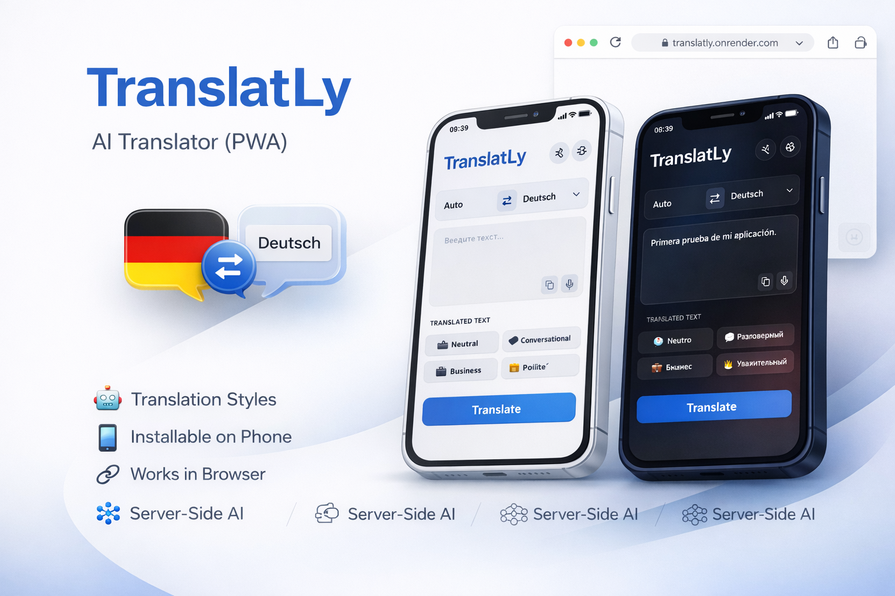

# TranslatLy — AI Translator (PWA)

TranslatLy is a web-based AI translator that works like a native app.  
It was built as a personal project to practice backend development, API design, and real-world architecture.

🌐 **Live demo:** https://translatly.onrender.com

---

## ✨ Features

- Text translation between languages
- Translation styles:
  - Neutral
  - Casual
  - Business
  - Polite
- Progressive Web App (PWA)
  - Can be installed on a phone
  - Works like a native app
- Clean and minimal UI
- Server-side AI processing (not browser-based)

---

## 🧠 How it works (high-level)

- Frontend sends a request to the backend
- Backend validates and processes the request
- AI model performs the translation
- Result is returned to the user

The project focuses on stability, cost optimization, and real backend logic rather than simple API wrappers.

---

## 📸 Screenshots

  
  
  

---

## 🚧 Project status

This project is under active development.

Planned improvements:
- Bug testing and edge cases
- Translation history
- Favorites (saved translations)
- Improved error handling
- UX refinements

Source code is private and not published.

---

## 🔗 Links

- 🌐 Website: https://translatly.onrender.com
- 📩 Email: kostiantyn.lk22@gmail
- 💬 Telegram: @WinGor0
- 📣 Telegram channel: https://t.me/kostiantyn_dev0
- 💼 Freelancehunt: https://freelancehunt.com/applicant/JDWNl.html
- 🛠 Freelance-kabanchik: https://kabanchik.ua/user/3854933

---

## 🌍 Other languages

- [Русская версия](README.ru.md)
- [Deutsche Version](README.de.md)
