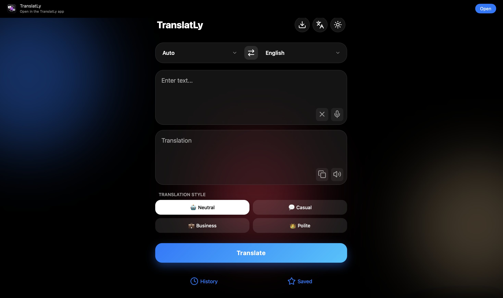
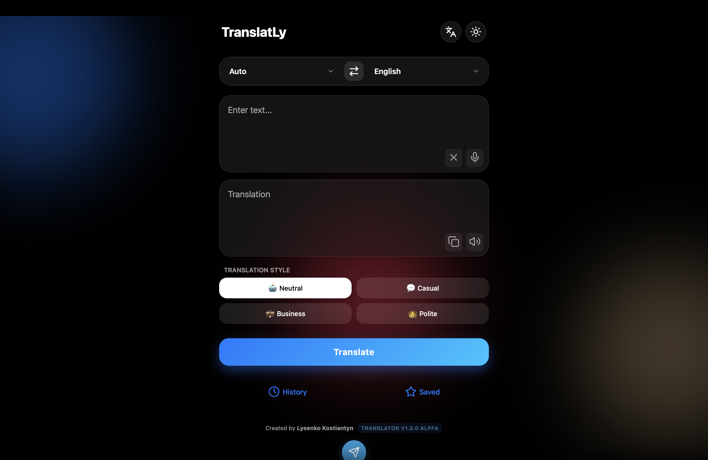
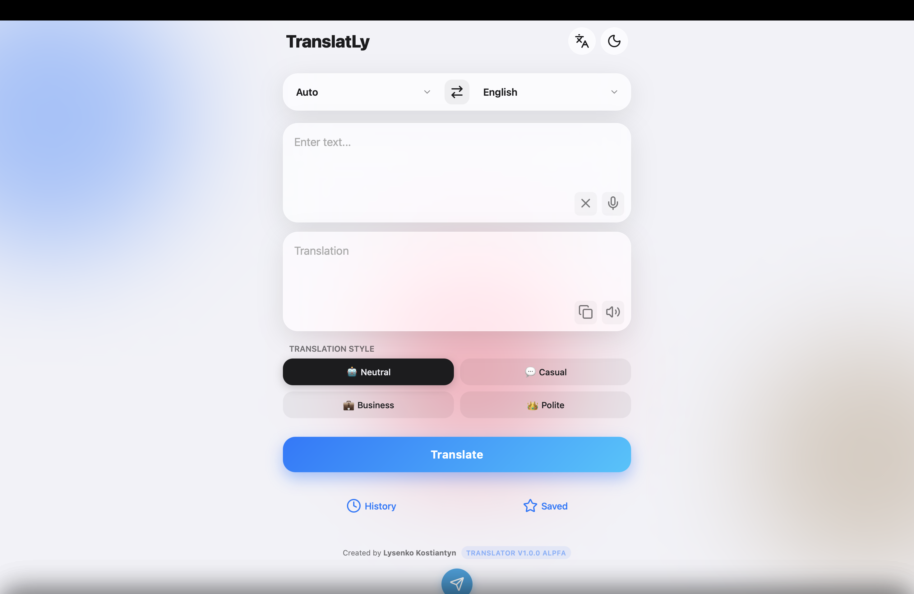

# TranslatLy — AI-переводчик (PWA)

TranslatLy — это веб-переводчик на базе ИИ, который работает как приложение.  
Проект сделан как личная разработка для практики backend и full-stack навыков.

🌐 **Онлайн-версия:** https://translatly.onrender.com

---

## ✨ Возможности

- Перевод текста между языками
- Выбор стиля перевода:
  - Нейтральный
  - Разговорный
  - Бизнес
  - Уважительный
- Работа как приложение (PWA)
- Минималистичный интерфейс
- Перевод обрабатывается на сервере

---

## 🧠 Как это работает

- Фронтенд отправляет запрос на сервер
- Сервер обрабатывает данные
- ИИ выполняет перевод
- Готовый результат возвращается пользователю

Проект сделан с упором на реальную архитектуру, а не просто вызов API.

---

## 📸 Скриншоты

  
  
  

---

## 🚧 Статус проекта

Проект находится в активной разработке.

Планы:
- Тестирование и исправление багов
- История переводов
- Избранное
- Улучшение UX

Исходный код закрыт.

---

## 🔗 Ссылки

- 🌐 Сайт: https://translatly.onrender.com
- 📣 Telegram: **ADD_LINK_HERE**
- 💼 Freelancehunt: **ADD_LINK_HERE**
- 🛠 Kabanchik: **ADD_LINK_HERE**

---

## 🌍 Другие языки

- [English version](README.md)
- [Deutsche Version](README.de.md)
